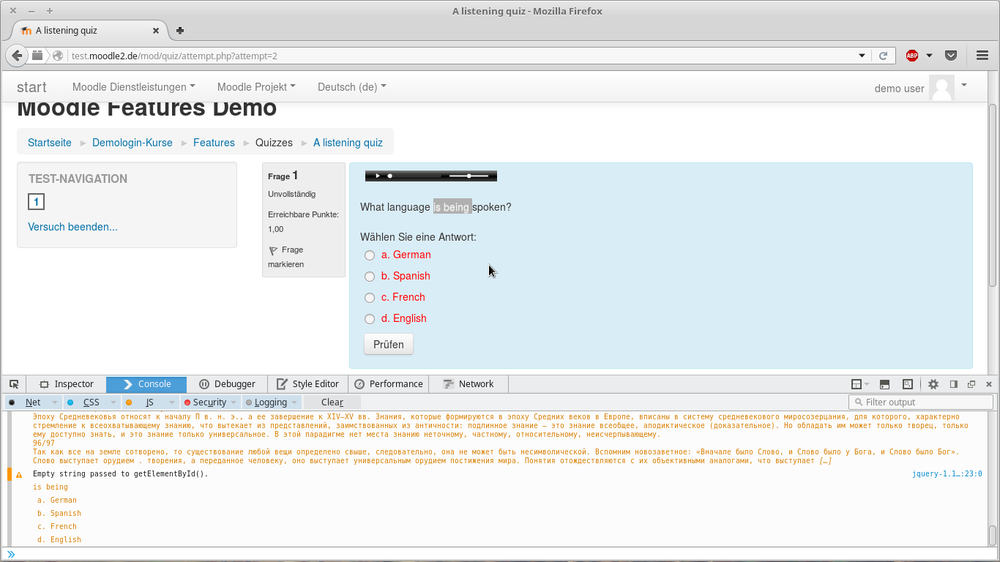

# helper
планировалось как дополнение к браузеру (есть если что код для firefox)

но принцип работы прост:

1. выделить часть вопроса (ключевые слова)
2. нажать хоткей и варианты окрасятся в зависимости от анализа (вот это и нужно допилить, блин)

в этом варианте

1. подгружает в локальное хранилище браузера текст (взял рандомную книгу из чата)
2. затем вешает обработчик на нажатие `shift + A`
3. все варианты ответов парсятся и пока выводятся в консоль, плюс все подкрашиваются

тестировал на [этом примере мудла](http://test.moodle2.de/blocks/demologin/logindemo.php?course=Features)

достаточно скопировать весь `data/helper.js` (прям текст, прям в консоль) (а можно только часть event listener, потому что анализа пока нет), а в квизе, выполнить выделение, затем нажать хоткей. повторное нажатие убирает подсвечивание.

анализ планировалось проводить по удалённости вариантов ответов от ключевых слов (выделенных) найденых в тексте.

сможет кто допилить анализ текста?
постепенно переписываю на получение ответов с сервера, без анализаторов и блэкджека...
